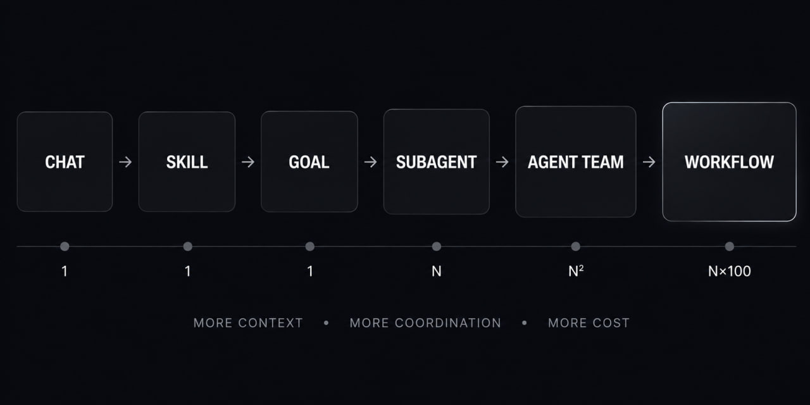

# Пересланный пост: уровни агентных систем и стоимость токенов

Вижу много мифологии вокруг новых фич, которые выходят в кодексе и клоде, поэтому решил нарисовать в GPT картинку. Есть много сложных слов и названий фич, которые придумывают лабы, каждая из которых стоит экспоненциально больше в токенах. Давайте разберемся какие и почему.

1. Чат: вы пишете агенту, а он делает действия, пишет и исполняет код, отвечает текстом.

2. Скилл: когда вы написали 3 раза одно и то же, вы просите его "создай skill[.]md" и появляется повторяемый скил, который содержит инструкции на естественном языке + опционально скрипты.

3. Цель: агент работает в цикле пока не достигнет однозначного ответа что goal == completed.

4. Субагент: скил или команда в чате может создать субагента, у которого свое отдельное окно контента для выполнения задачи. Этот агент управляется основным, не имеет полного контента проекта или задачи.

5. Команда: для более сложных задач можно создать мультиагентную систему (agent team в Клоде), где, в отличии от субагентов, они могут общаться друг с другом и работать интерактивно. Стоит дороже, но позволяет сделать более сложные задачи с полным сохранением контекста.

6. /workflow: это повторяемые и описанные в коде рабочие процессы. В отличии от скилла или команды, здесь код управляет Клодами и может запускать десятки (или сотни, если хватит токенов) агентов и итераций. В отличии от целей, воркфлоу повторяемы, передаваемы, улучшаемы и по сути являются просто typescript кодом.

## Синтез после обсуждения

Чем дальше вправо, тем меньше это похоже на «чат с моделью» и тем больше — на вычислительную систему, где LLM является дорогим исполнительным блоком.

- Скиллы экономят повторное объяснение и стандартизируют практику.
- Goals покупают автономный цикл до критерия завершения.
- Субагенты покупают изоляцию контекста и параллелизм.
- Agent teams покупают координацию между ролями.
- Workflows покупают воспроизводимость, программное управление и масштабирование итераций.

Главный тезис: новые «магические» фичи обычно покупают не интеллект из воздуха, а больше контекста, больше координации, больше проверок и больше токенов.
