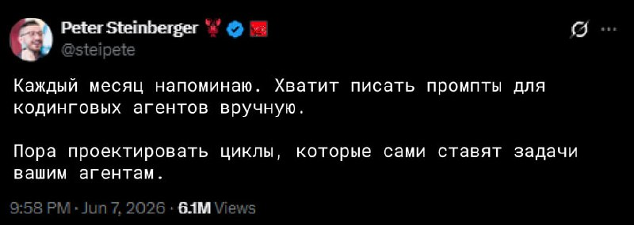
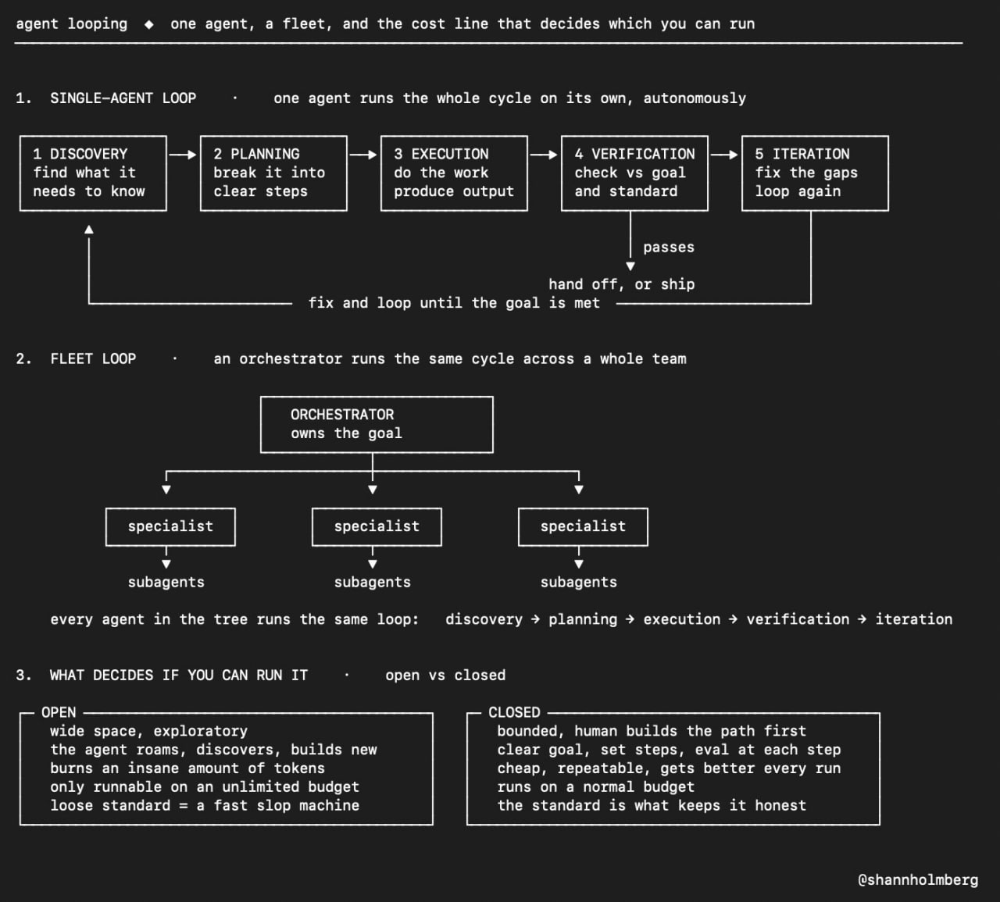

# Agent looping: single-agent, fleet, open и closed loops

Источник: сообщение пользователя в Telegram от 2026-06-09.





```text
«Каждый месяц напоминаю. Хватит писать промпты для кодинговых агентов вручную. Пора проектировать циклы, которые сами ставят задачи вашим агентам».
— Peter Steinberger 🚬

Последние 2 года мы давали агентам задачи по одной. Сделай лендинг. Напиши статью. Найди баг. Потом вручную запускаем следующий шаг. Сейчас появляется другой подход - agent looping.

Вместо того чтобы вести агента через каждый этап, вы создаёте цикл, который сам занимается исследованием задачи, планированием, выполнением работы, проверкой результата и повторными итерациями до достижения цели.

Looping не привязан к конкретной модели. Это схема работы, которую вы собираете сами. Запустить её может почти любой агентный фреймворк.

Самый простой вариант выглядит так:
- исследование задачи
- создание черновика
- проверка результата относительно цели
- исправление слабых мест
- повтор цикла до выполнения требований

Вы больше не пишете промпт для каждого шага. Агент сам проходит этот цикл столько раз, сколько нужно.

Следующий уровень fleet looping. Появляется агент-оркестратор. Он получает цель, разбивает её на части и раздаёт задачи специализированным агентам. Те, в свою очередь, могут подключать собственных субагентов для более узких задач.

В результате получается целое дерево агентов. Каждый уровень постоянно проходит через исследование, планирование, выполнение и проверку, пока цель не будет достигнута.

Один агент в цикле похож на человека, который несколько раз переписывает собственный черновик. Fleet looping больше напоминает полноценную команду, которая ведёт проект от постановки задачи до финального результата. 

Вы задаёте цель. Система сама продолжает работать, пока не уложится в заданные требования.

Open Looping. Open Looping даёт агенту много свободы. Цель есть. Ограничения тоже есть. Но внутри этих рамок агент может исследовать разные направления, пробовать разные подходы и находить решения, которые вы заранее не описали.

Сейчас именно это выглядит самым интересным направлением. Этим занимаются Peter и многие другие исследователи. Проблема в стоимости. Открытый цикл с реальной свободой исследования сжигает огромное количество токенов. Для 90% людей без неограниченного бюджета такой подход пока слишком дорог. А если направить его на проект с размытыми критериями качества, он быстро превращается в генератор мусора.

Closed Looping. Closed Looping работает гораздо жёстче.

Человек заранее проектирует весь процесс:
- чёткая цель
- фиксированные шаги
- проверка на каждом этапе
- точка остановки или возврата результата

Агенты всё так же работают в цикле, но уже внутри созданного вами каркаса. С каждым запуском результат становится лучше, потому что данные предыдущих проходов используются в следующих. И всё это укладывается в обычный бюджет, потому что путь выполнения заранее ограничен.

btw: Если хочется посмотреть на это вживую, то тут состряпали проект: https://loops.elorm.xyz/loops

Это каталог готовых воркфлоу для ваших агентов. Копируете kickoff-промпт, задаёте условия завершения и запускаете цикл.

Сейчас доступно 40 готовых loop-сценариев. Респект за loops! 🫢
```

## Краткое описание изображений

Первое изображение — скриншот твита Peter Steinberger о том, что вместо ручного написания промптов для coding agents пора проектировать циклы, которые сами ставят задачи агентам.

Второе изображение — схема agent looping: одиночный агент проходит discovery → planning → execution → verification → iteration; fleet loop добавляет оркестратора, специалистов и субагентов; выбор между open и closed looping определяется стоимостью, свободой исследования и жесткостью стандартов проверки.
