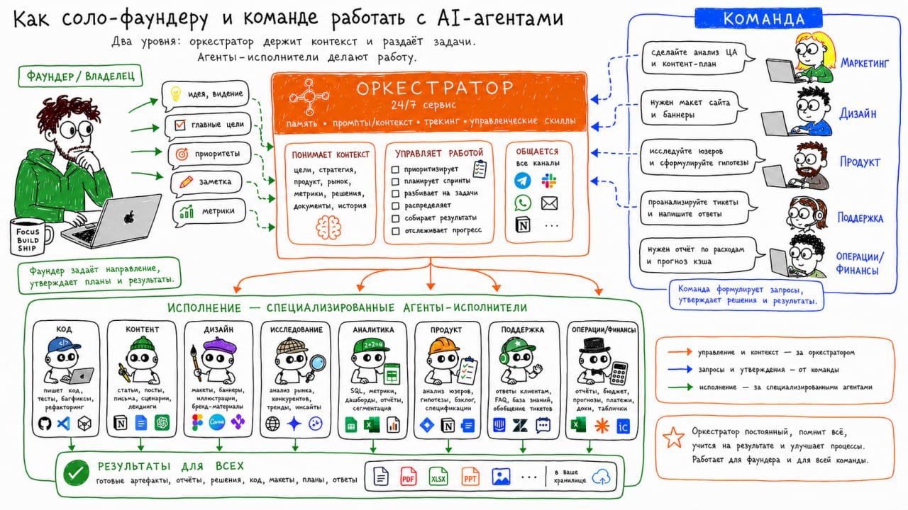

# Hermes против Codex: оркестрация против исполнения в масштабах

Источник: сообщение пользователя в Telegram от 2026-06-05.



```text
⚔️ Hermes против  Codex 
(Оркестрация против исполнения в масштабах: что и зачем?) 

Личный опыт из соло работы и внедрения в компании. 

OpenClaw или Hermes ставим на сервер как 24/7-сервис, и подключаем к системе задач и любимому чату: теперь это наш менеджер 🧢, он принимает задачи из чата, знает контекст продукта и бизнеса, помнит правила, достаёт нужные скиллы и передаёт работу агентам. 

Это закрывает необходимость постоянной синхронизации контекста: 
Есть чаты, трекер, база знаний, промпты, скиллы, агенты, люди.
Но контекст разъезжается: часть в чате, часть в трекере, часть в головах, часть в базе знаний, часть в ручных сессиях с агентами.

Решаем разделением на роли и зоны ответсвенности 

Оркестратор: Hermes / OpenClaw.
Легкий 24/7 агент на сервере, не залоченная на вендора. 
Он понимает задачу, достаёт контекст, следит за процессом и возвращает результат обратно в рабочий поток тегая ответсвенных.

Исполнители: Codex, Claude Code, Cursor, Pi, OpenCode и другие.
Они делают конкретную работу: код, тексты, документы, ресерч, аналитику, дизайн, поддержку, рутину. 

Зачем так сложно? 
(это налог на оркестрацию)
Запустить агента легко.
Сложно довести работу до конца, закрыт рабочий цикл.

Нужно понять, какой контекст ему дать.
Проверить, что он сделал.
Согласовать результат с остальными задачами.
Зафиксировать статус.
Вернуть результат туда, где команда или вы сами продолжаете работу.

Оркестрация нужна, чтобы закрывать цикл:
задача → контекст → исполнитель → результат → проверка → фиксация → следующий шаг.

Иначе ручной запуск 20 агентов выглядит впечатляюще, но ялвялется лишь иллюзию продуктивности.
```

## Краткое описание изображения

Схема показывает двухуровневую работу с AI-агентами: фаундер или команда формулируют цели, приоритеты и запросы; оркестратор 24/7 держит память, промпты, контекст, трекинг и управленческие скиллы; специализированные агенты-исполнители делают код, контент, дизайн, исследования, аналитику, продуктовые задачи, поддержку и операции/финансы; результаты возвращаются в общее хранилище и рабочий поток.
