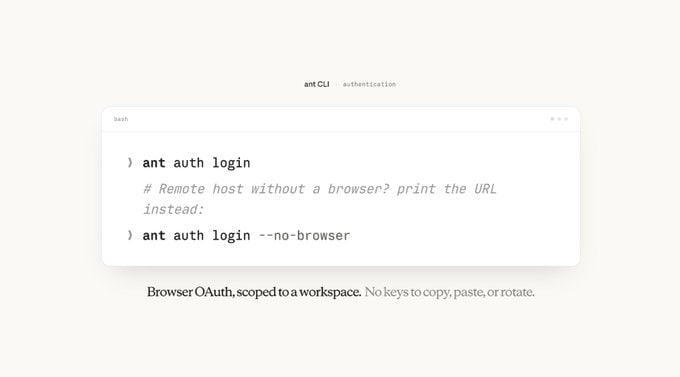

# Anthropic ant CLI для Claude Platform

Антропик завезли CLI для Claude Platform, который позволяет запускать любой API-эндпоинт прямо из терминала: /ant

Можно дергать Messages API, поднимать Claude Managed Agents и прокидывать результаты сразу в shell через пайпы.

CLI ant хорошо понимается кодовыми агентами вроде Claude Code через навык claude-api.

Для интерактивной авторизации есть:

```bash
ant auth login
```

Команда запускает OAuth-флоу через браузер, привязывает токен к конкретному воркспейсу и сохраняет его локально.

После этого тот же токен используют CLI и SDK для аутентификации API-запросов.

Каждый API-ресурс доступен как отдельная подкоманда: messages, models, files и другие.
Запросы можно собирать через типизированные флаги или YAML из пайпа. Файлы подключаются через @path, а ответы можно преобразовывать через --transform.

Поддерживаются форматы вывода json, yaml, jsonl и explore (по умолчанию) с TUI-интерфейсом, поиском и сворачиваемыми секциями.

Через ant также можно создавать и обновлять Claude Managed Agents как локально, так и из CI.

Конфигурацию агента можно хранить в Git в виде YAML, а затем синхронизировать изменения с Claude Platform прямо из CI:

```bash
ant beta:agents update
```

CLI умеет запускать сессии Managed Agents, отправлять им события и наблюдать, как агент рассуждает, вызывает инструменты и выполняет задачу.

Если агент завершил работу или застрял, можно вытащить полный трейс: все события, вызовы инструментов и принятые решения доступны через тот же CLI.

Claude Code уже умеет работать с ant через встроенный скилл:

```text
/claude-api
```

Можно попросить его показать список сессий, загрузить папку с PDF или помочь разобраться с проблемным запуском.

Под капотом он просто вызывает CLI и читает результаты обратно. Никакого дополнительного glue-кода не требуется.

Установка доступна через brew, curl или go. 🎉🎉🎉



## Описание изображения

На изображении показан экран `ant CLI authentication` с командами:

```bash
ant auth login
# Remote host without a browser? print the URL instead:
ant auth login --no-browser
```

Подпись: “Browser OAuth, scoped to a workspace. No keys to copy, paste, or rotate.”
