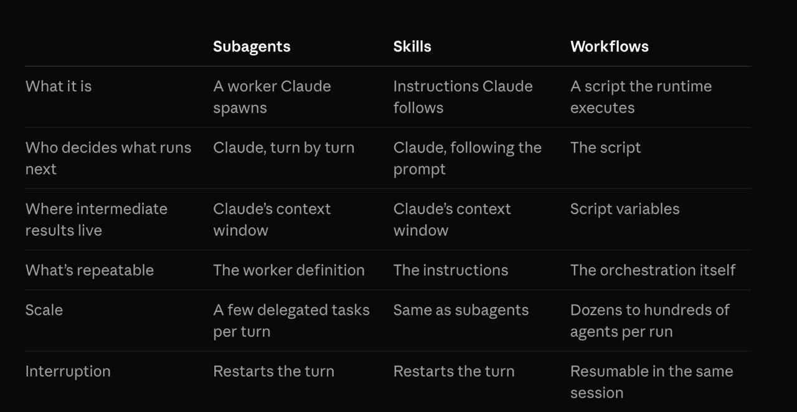

# Claude Code Dynamic Workflows

Источник: сообщение пользователя в Telegram от 2026-06-09.



```text
В Claude Code добавили Dynamic Workflows

Это новый способ управления субагентами — через скрипты. 

Ключевое преимущество заключается в том, что при таком подходе не нужен агент-оркестратор, который будет рулить всеми субагентами и результатами их работы. Результаты работы субагентов сохраняются в переменных скрипта и не забивают контекст Claude, благодаря чему мы можем запускать хоть 100 субагентов без серьёзных проблем с контекстом.

Прямо в Claude Code теперь можно строить сложные пайплайны со structured outputs, где в каждом шаге модель будет возвращать ответ строго в заданном формате.

Dynamic Workflows можно легко попробовать: в Claude Code добавили команду /deep-research, которая работает на их основе.

Документация тут — можно обсудить с клодом как это можно применить к вашим задачам.
```

## Краткое описание изображения

Скриншот сравнивает три механизма Claude Code:

- **Subagents** — worker Claude, которого запускает Claude; следующий шаг выбирает Claude turn-by-turn; промежуточные результаты живут в контексте Claude; масштаб — несколько делегированных задач за turn; прерывание перезапускает turn.
- **Skills** — инструкции, которым следует Claude; следующий шаг выбирает Claude по prompt; промежуточные результаты также живут в контексте Claude; повторяемы сами инструкции; масштаб примерно как у subagents; прерывание перезапускает turn.
- **Workflows** — скрипт, который исполняет runtime; следующий шаг выбирает скрипт; промежуточные результаты живут в переменных скрипта; повторяема сама оркестрация; масштаб — десятки или сотни агентов за run; прерывание можно возобновить в той же сессии.
