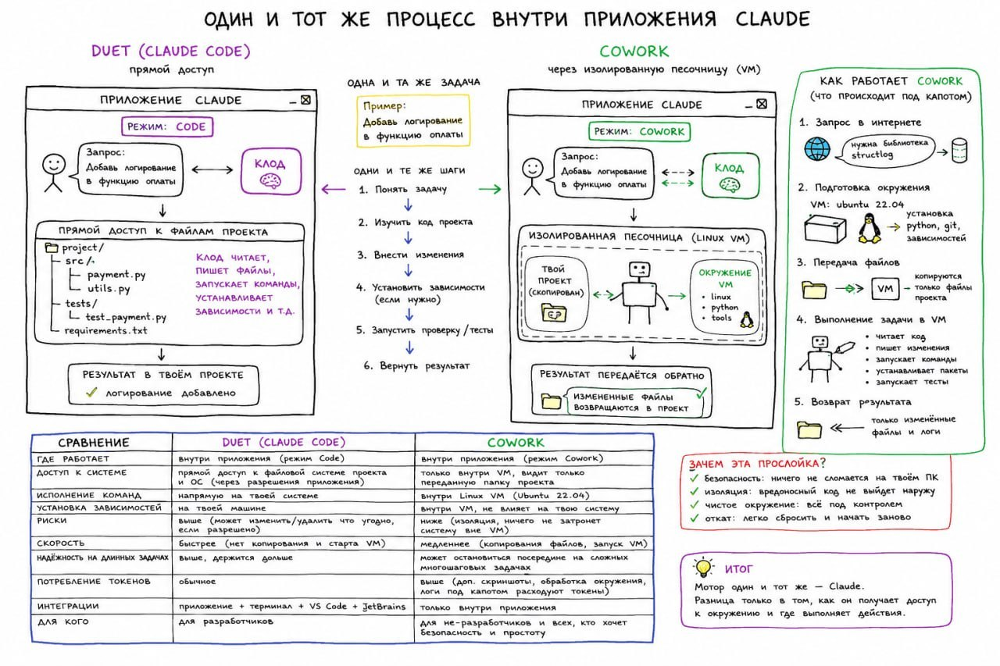

# Claude Duet vs Cowork sandbox comparison

Источник: пересланное изображение из Telegram без дополнительного текста.

## Краткое описание изображения

Схема сравнивает два режима выполнения одной и той же задачи внутри приложения Claude: **Duet (Claude Code)** с прямым доступом к проекту и **Cowork** через изолированную Linux VM-песочницу.

В центре показано, что задача и логика работы одинаковые: например, «добавь логирование в функцию оплаты». Шаги тоже совпадают: понять задачу, изучить код проекта, внести изменения, при необходимости установить зависимости, запустить проверку/тесты и вернуть результат.

Слева Duet/Claude Code работает в режиме `Code`: Claude получает прямой доступ к файлам проекта и операционной системе пользователя, читает и пишет файлы, запускает команды, устанавливает зависимости. Результат сразу оказывается в проекте пользователя.

Справа Cowork работает в режиме `Cowork`: приложение Claude копирует проект в изолированную Linux VM, где есть окружение с Linux, Python и tools. Агент выполняет задачу внутри VM, а обратно в проект возвращаются только изменённые файлы и логи.

Отдельный блок объясняет механику Cowork:

1. Запрос в интернете, если нужна библиотека.
2. Подготовка окружения: VM на Ubuntu 22.04, установка Python, Git и зависимостей.
3. Передача файлов: копируются только файлы проекта.
4. Выполнение задачи в VM: чтение кода, внесение изменений, запуск команд, установка пакетов, тесты.
5. Возврат результата: только изменённые файлы и логи.

Сравнительная таблица подчёркивает компромиссы:

- Duet быстрее, потому что не копирует проект и не стартует VM, но выше риск для локальной системы.
- Cowork медленнее и может быть менее надёжен на длинных задачах, зато изолирует вредоносный код, не затрагивает основную систему и легко откатывается.
- У Cowork выше потребление токенов из-за дополнительных скриншотов, подготовки окружения и логов.
- Duet лучше подходит разработчикам с привычной локальной интеграцией через приложение, терминал, VS Code и JetBrains.
- Cowork ориентирован на не-разработчиков и пользователей, которым важны безопасность и простота.

Итог изображения: «мотор» один и тот же — Claude; различается способ доступа к окружению и место выполнения действий.

## Связанные страницы

- [[claude-code]]
- [[claude-duet-vs-cowork]]
- [[agentic-coding-workflows]]
