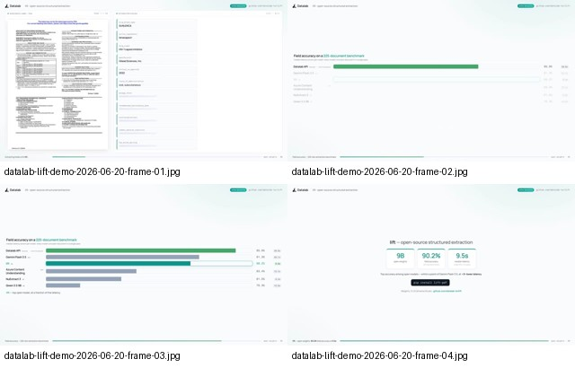
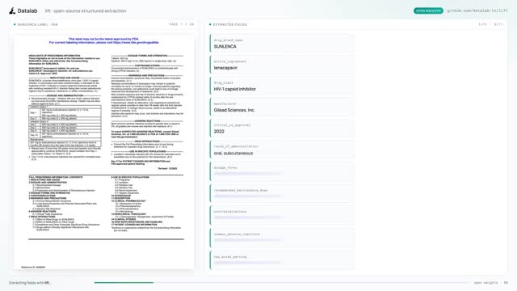
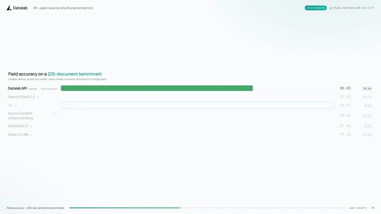
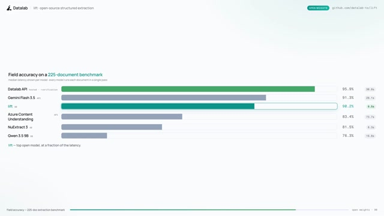
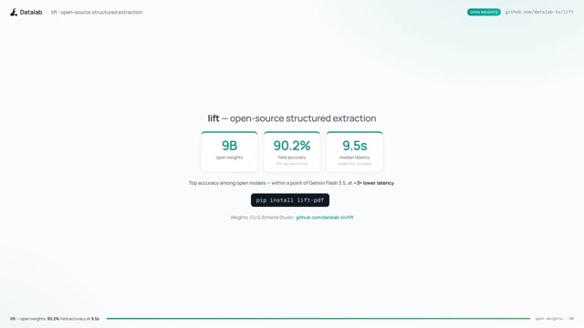

# Datalab Lift: 9B-модель для structured extraction из документов

## Исходный текст

Datalab открыла исходный код Lift — 9B-модели для извлечения структурированных данных из документов.

По заявлению разработчиков, модель показывает 90,2% точности на их бенчмарке против 91,3% у Gemini 3.5 Flash и заметно опережает специализированные опенсорс решения вроде NuExtract3 (81,5%).

Lift умеет извлекать данные по JSON Schema, а медианное время обработки составляет 9,5 секунды.

Для запуска достаточно: pip install lift-pdf

Модель и код доступны в открытом доступе. 👍

## Видео

Оригинальный вложенный ролик сохранён: [datalab-lift-demo-2026-06-20.mp4](../assets/datalab-lift-demo-2026-06-20.mp4)

Контакт-лист кадров из ролика:

Отдельные кадры:

## Краткое описание

Заметка фиксирует [[lift]] как открытую 9B vision-модель для [[document-structured-extraction]]: пользователь задаёт JSON Schema, а модель извлекает из PDF/изображений валидный JSON. Важный практический мотив — заменить или дополнить closed-source document AI API в сценариях, где нужны локальный запуск, воспроизводимость и schema-constrained output.

## Проверка источника

Публичный репозиторий `datalab-to/lift`, PyPI-пакет `lift-pdf` и Hugging Face карточка `datalab-to/lift` подтверждают основные пункты: 9B vision model, извлечение structured JSON из PDFs/images по JSON Schema, schema-constrained decoding, CLI/API, режимы HuggingFace и vLLM, Schema Studio и установку через `pip install lift-pdf`. README/модельная карточка приводят benchmark: Lift — 90,2% field accuracy, Gemini Flash 3.5 — 91,3%, NuExtract3 — 81,5%, median latency Lift — 9,5s. Сноска в источнике уточняет, что latency зависит от hardware/load и дана как относительная, а не абсолютная величина.
