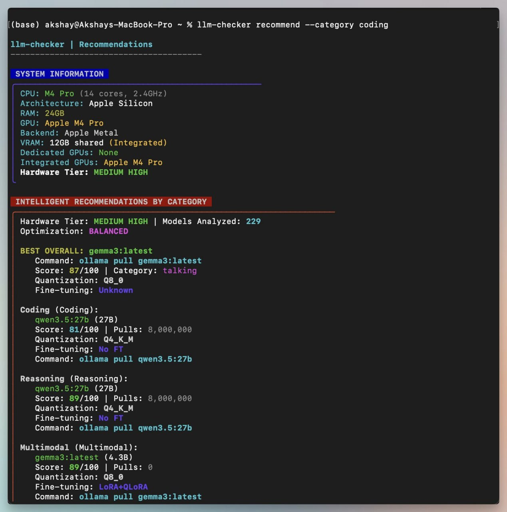

# llm-checker: рекомендации локальных LLM по железу

## Оригинальный пересланный текст

Нашёл простой способ узнать, какие LLM потянет ваш компьютер. ( и это не /llmfit)

Устанавливаете:
```bash
npm install -g llm-checker
```

Определяете характеристики железа:
```bash
llm-checker hw-detect
```

Получаете рекомендации моделей под нужную задачу:
```bash
llm-checker recommend --category coding
```

Утилита анализирует ваше железо и подсказывает, какие модели имеет смысл запускать локально, вместо бесконечных экспериментов в духе (а вдруг запустится).

Для тех, кто играет с локальными LLM через Ollama, LM Studio или Open WebUI, штука может сэкономить немало времени. ☕️



## Наблюдения по скриншоту

Скриншот показывает пример команды `llm-checker recommend --category coding` на MacBook Pro с Apple M4 Pro, 24GB RAM, Apple Metal backend и оценкой hardware tier `MEDIUM HIGH`. В примере утилита анализирует 229 моделей и рекомендует `qwen3.5:27b` для coding/reasoning и `gemma3:latest` для multimodal/best overall.

## Проверенная внешняя справка

По README/GitHub и npm-описанию `llm-checker` позиционируется как CLI для анализа CPU/GPU/RAM/backend и подбора локальных LLM, включая Ollama-каталог, команды `hw-detect`, `check`, `recommend`, `installed`, `ollama-plan`, `verify-context`, `toolcheck` и другие. В публичном описании заявлена детерминированная оценка 200+ Ollama-моделей и 7k+ вариантов, packaged SQLite catalog и hardware-calibrated memory estimation.
