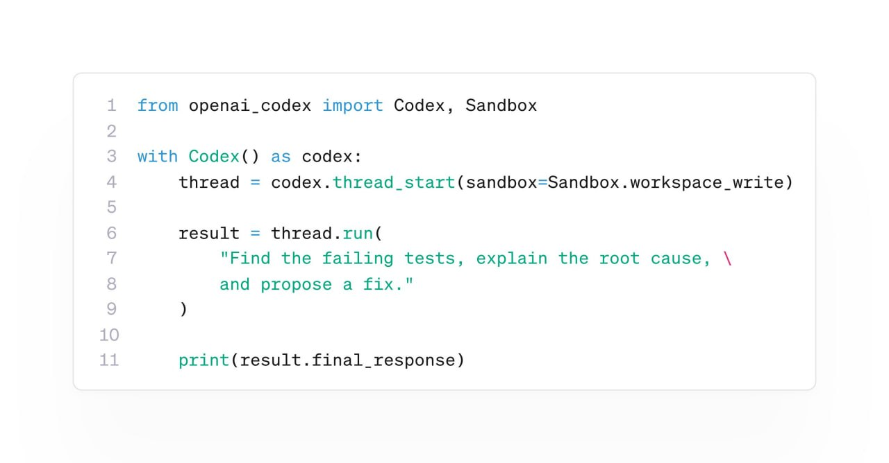

# Пересланный пост: OpenAI Codex Python SDK

OpenaAI выпустили Python SDK для Codex 🔥

Теперь Codex можно встроить прямо в своё Python-приложение без костылей и обёрток.

Можно запускать новые сессии, выполнять отдельные шаги агента, получать потоковые обновления о ходе выполнения, возобновлять ранее созданные сессии, передавать изображения и управлять доступом к sandbox-окружению.

При этом используется уже настроенная авторизация Codex.

Установка:
pip install openai-codex

Пора что-нибудь собрать на его основе

[Image attached at: /home/user/.hermes/image_cache/img_c60fc19e4376.jpg]



## Содержимое скриншота

На приложенном скриншоте показан минимальный пример на Python:

```python
from openai_codex import Codex, Sandbox

with Codex() as codex:
    thread = codex.thread_start(sandbox=Sandbox.workspace_write)

    result = thread.run(
        "Find the failing tests, explain the root cause, \
        and propose a fix."
    )

    print(result.final_response)
```
